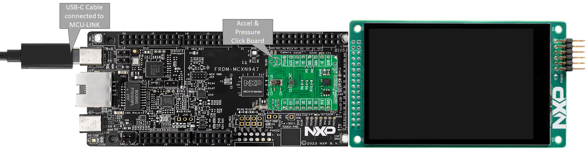

# NXP Application Code Hub

## Multi sensor demo with FRDM-MCXN947 and LDC-PAR-S035
This demo shows how to integrate the NXP sensors FXLS8974CF (3-axis accelerometer) and MPL3115 (absolute pressure) with FRDM-MCXN947 platform. Both sensors share the I2C bus of the Accel & Pressure click board, that is used in the demo for digital communication between the MCXN947 and the sensors.

The demo uses the LVGL graphics framework and a TFT Display (LCD-PAR-S035) to show sensor data. The GUI shows a multi-Tab menu that allows the user to:
- Monitor the 3-axis accelerometer measurements.
- Monitor the pressure sensor measurements in Pascals.
- Watch a live chart with the latest 40 points of the 3-axis accelerometer.  

The GUI was designed with GUI Guider (NXP).

- #### Boards: FRDM-MCXN947
- #### Accessories: mikroe_accel_pressure_click
- #### Categories: Graphics, HMI, Sensor
- #### Peripherals: DISPLAY, I2C, SENSOR, GPIO, UART
- #### Toolchains: MCUXpresso IDE

## Table of Contents
1. [Software](#step1)
2. [Hardware](#step2)
3. [Setup](#step3)
4. [Results](#step4)
5. [Support](#step5)

## 1. Software
- [IoT Sensing SDK (ISSDK) v1.8](https://nxp.com/iot-sensing-sdk) offered as middleware in MCUXpresso SDK for supported platforms
- [MCXUpresso SDK 2.14.0 for FRDM-MCXN947](https://mcuxpresso.nxp.com/en/builder?hw=FRDM-MCXN947)
- [MCUXpresso IDE v11.9.0](https://www.nxp.com/design/design-center/software/development-software/mcuxpresso-software-and-tools-/mcuxpresso-integrated-development-environment-ide:MCUXpresso-IDE)
- Git v2.39.0

## 2. Hardware
*For this demo you will need the next hardware.*
- [FRDM-MCXN947 MCU board](https://www.nxp.com/part/FRDM-MCXN947)  

- [LCD-PAR-S035 TFT Display](https://www.nxp.com/design/design-center/development-boards-and-designs/general-purpose-mcus/3-5-480x320-ips-tft-lcd-module:LCD-PAR-S035)  

- [Accel & Pressure Click Board](https://www.mikroe.com/accelpressure-click)  

- Personal Computer
- Mini/micro C USB cable

## 3. Setup
The following instructions are based on MCUXpresso IDE.  However, similar steps can be followed for VS Code. Example includes linker files that allows demo to be imported and converted. 

### 3.1 Step 1: Connect Display to FRDM-MCXN947
Check that the switch SW1 In the LCD is set to 010 (16bits 8080) and plug-in the LCD in the board (use the next image like reference) you should connect the LCD in the J8 header with two pins free in the top of the header.

### 3.2 Step 2: Connect Accel & Pressure click board atop FRDM-MCXN947
Plug-in the Accel & Pressure click board (mikroe) atop the native mikroe slot of the FRDM board.  
Then plug-in the USB cable between the host PC and the FRDM-MCXN947.  
*See the figure below for reference.*  

### 3.3 Step 3: Download and Install required Software(s)
- Download [MCUXpresso IDE 2.19.0 or newer](https://www.nxp.com/design/design-center/software/development-software/mcuxpresso-software-and-tools-/mcuxpresso-integrated-development-environment-ide:MCUXpresso-IDE?&tid=vanMCUXPRESSO/IDE) and Install following the installer instructions.
- Download [MCXUpresso SDK 2.14.0 for FRDM-MCXN947](https://mcuxpresso.nxp.com/en/builder?hw=FRDM-MCXN947). Make sure to select ISSDK middleware while building SDK. **Make sure to change version to 2.14.00 and build SDK for MCUXpresso IDE.**
- Install Git v2.39.0 (for cloning and running west commands)

### 3.4 Step 4: Build demo project
- Open MCUXpresso IDE and select a directory to create your workspace.
- Install "MCXUpresso SDK 2.14.0 for FRDM-MCXN947" (drag and drop SDK zip into "Installed SDK" view) into MCUXpresso IDE.
- Go to "Quickstart Panel" and click on "Import from Application Code Hub".  
  
- Enter "Accel and Pressure sensor demo" in search bar.  Select project card.
- Click "GitHub link" within wizard to copy github information into IDE wizard.  
  
- Continue to follow the default steps of the Wizard.  Click Next, Click Next for "main" branch.
- Select the desired destination to store the imported project.  Initial branch = main.  Click Next.
- Click next to select the discovered Eclipse projects.
- Click Finish to complete the import into workspace.
  
  
- Right click on project and select build to start building the project.

## 4. Results
*The demo will start running inmediately after the FW is downloaded to the target from MCUXpresso.*  
*The GUI shows the Accel. panel by default. It will show acceleration measurements coming from the 3-axis accelerometer (FXLS8974CD), note that the vector magnitude is also shown.*  
*The user can easily switches to another tab by tapping, for example to visualize the pressure subjected to the MPL3115 sensor.*  
*The third tab "chart" shows the latest collected 40 samples for the three axis of the accel.*  
*The figure below shows the demo running...*  

## 5. Support
- Reach out to NXP Sensors Community page for more support - [NXP Community](https://community.nxp.com/t5/forums/postpage/choose-node/true?_gl=1*fxvsn4*_ga*MTg2MDYwNjMzMy4xNzAyNDE4NzM0*_ga_WM5LE0KMSH*MTcwMjQxODczMy4xLjEuMTcwMjQxODczNi4wLjAuMA..)
- Learn more about FXLS8974CF 3-axis accelerometer, refer to - [FXLS8974CF DS](https://www.nxp.com/docs/en/data-sheet/FXLS8974CF.pdf)
- Learn more about MPL3115A2S Precision pressure sensor, refer to - [MPL3115A2S DS](https://www.nxp.com/docs/en/data-sheet/MPL3115A2S.pdf)
- Accelerate your sensors development using Sensor ToolBox, refer to - [Sensors Development Ecosystem](https://www.nxp.com/design/design-center/software/sensor-toolbox:SENSOR-TOOLBOXX)

#### Project Metadata
<!----- Boards ----->

<!----- Categories ----->

<!----- Peripherals ----->
    

<!----- Toolchains ----->

Questions regarding the content/correctness of this example can be entered as Issues within this GitHub repository.

>**Warning**: For more general technical questions regarding NXP Microcontrollers and the difference in expected funcionality, enter your questions on the [NXP Community Forum](https://community.nxp.com/)

## 7. Release Notes
| Version | Description / Update                           | Date                        |
|:-------:|------------------------------------------------|----------------------------:|
| 1.0     | Initial release on Application Code Hub        | May 17th 2024 |

